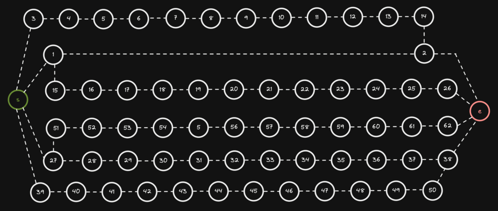

# Lem-in - "Pathfinding Algorithm"


## Table of Contents

1. [Description](#description)
2. [Input](#input)
3. [Output](#output)
4. [How to use](#how-to-use)
5. [Algorithms](#algorithms)
6. [Data Structures](#data-structures)
7. [Resources](#resources)
8. [Tools](#tools)
9. [Keywords](#keywords)

## Description

The main idea behind project `Lem-in` is to find the most efficient set of paths to move **_n_** amount of ants from the **start** room to the **end** room.
This process has to be done as fast as possible.

There are certain rules that we need to follow:

1. When the program starts, all of the ants are in the `##start` room.

2. Room can contain only one ant at a time. `##start` and `##end` rooms can contain an unlimited amount of ants.

3. With each turn you can move every single ant one time.


### Grading

There were two main things in how the project was graded:

1. Time complexity

2. Algorithm's accuracy

To test both of these we use the map `generator` that was provided for us.
To generate the biggest possible map we can use our `Makefile` like so:\
`make the map`\
This generates a map called `generator_map.map`

#### Time Complexity grades

| Grade | Program runtime |
| --- | --- |
| 5 | ≤ 3 seconds |
| 4 | ≤ 6 seconds |
| 3 | ≤ 9 seconds |
| 2 | ≤ 12 seconds |
| 1 | ≤ 15 seconds |

This can be easily tested like so:\
`time lem-in < generator_map.map`

#### Algorithm's accuracy grades:

If you inspect the generated map you can find line:\
`#Here is the number of lines required: 87`\
This is the turn count that we need to match for the max grade.

| Grade | Δ turns made |
| --- | --- |
| 5 | Turn count is identical or less |
| 4 | ≤ 2 |
| 3 | ≤ 3-10 |
| 2 | ≤ Increases dramatically |
| 1 | ≤ Far from the objectives |

Under our testing *Time complexity* of the program never exceeded `0.15 seconds`. So we think we did pretty well on that part.

Our testing average of *Algorithm's accuracy* was on the 4-grade mark. Sometimes turn count is exceeded by 2 moves.

#### Final grade:

**Time complexity** 5\
**Algorithm's accuracy** 4

## Input

The best way to input an ant farm of your choice is to create a file and specify your map there.\
Here is a list of all the specifications that the file can and cannot contain:

| Description                         | Command      | Note                                                                                |
| ----------------------------------- | ------------ | ----------------------------------------------------------------------------------- |
| First line of the file              | `21`         | The first line is always the ant count                                              |
| Specify start room                  | `##start`    | **REQUIRED**                                                                        |
| Specify end room                    | `##end`      | **REQUIRED**                                                                        |
| Comment                             | `#`          | Program will ignore all the commands                                                |
| Specify room                        | `start 0 1`  | Room name cannot start with `L` or `#`. Also, a name cannot contain a `-` character |
| Describe the link between two rooms | `start-end`  |                                                                                     |
| Extra commands                      | `##anything` | Extra commands will be ignored                                                      |

|                  Ant farm                   |               Map visualization               |
| :-----------------------------------------: | :-------------------------------------------: |
|  |  |

## Output

The output format of the program is the following:\
`Lx-y Lz-w Lr-o`\
x, z, and r represent ant numbers (going from 1 to number_of_ants).\
y, w, and o represents room names.\
One line == One turn \
When we use the map shoved above, the output is the following:\
`L1-1 L2-3`\
`L1-5 L2-4 L3-1 L4-3`\
`L1-6 L2-2 L3-5 L4-4`\
`L1-end L2-end L3-6 L4-2`\
`L3-end L4-end`


**NOTE!**\
If you are wondering what happens between room `1` and room `2`, all of this will be explained in the [Algorithms](#algorithms) section.

## How to use

### Compiling

At the root of the repository, there is a `Makefile`, simply running `make` will compile the whole program - the name of the program will be `lem-in`.

### Running `lem-in`

`lem-in < name_of_the_map`

### Running with flags

#### `-l` Flag

Running `lem-in` with the flag `-l` will show how many turns it took to move all ants from `##start` to `##end`.

`lem-in -l < name_of_the_map`

```text
./lem-in -l < eval_tests/test_maps/example_3.map
L1-1 L2-3
L1-5 L2-4 L3-1 L4-3
L1-6 L2-2 L3-5 L4-4
L1-end L2-end L3-6 L4-2
L3-end L4-end
Move count:
5
```

#### `-p` Flag

Running `lem-in` with the flag `-p` will show a set of paths used to move ants from `##start` to `##end`.

`lem-in -p < name_of_the_map`

```text
./lem-in -p < eval_tests/test_maps/example_3.map
Our Algo chose paths:
PATH [1] = start -> 1 -> 5 -> 6 -> end length = 3
PATH [2] = start -> 3 -> 4 -> 2 -> end length = 3
```

## Algorithms

Many different Algorithms were used so we can find the:

1. Shortest paths
2. Vertex disjoint paths
3. Most efficient set of paths for ***n*** amount of ants

### Breadth-first search

With the help of the Breadth-first search algorithm (shortened to bfs), we can find ALWAYS the shortest path from `##start` to `##end`.

Here is an example:



What we can see from this example is that a Breadth-first search can find the shortest path efficiently.

<details>
<summary>bfs() function from the source code</summary>

```c
static int  bfs(t_data *data, t_queue **head)
{
    t_queue *que;
    t_queue *tail;

    que = NULL;
    tail = NULL;
    bfs_init(data, head, &tail, &que);
    while (data->end->parent == NULL && que != NULL)
    {
        iterate_links(&tail, que);
        que = que->next;
    }
    if (!data->end->parent)
        return (0);
    set_flows(data);
    return (1);
}
```
</details>

### Matthew Daws Vertex Disjoint

Finding the [Vertex Disjoint](https://www.youtube.com/watch?v=kwWN4FIEyz8&ab_channel=WrathofMath) paths is the key thing in the whole project. Thank you [Matthew Daws](https://matthewdaws.github.io/blog/index.html)!\
In this example, we can see something interesting happening between room `1` and room `2`.


When our second BFS finds a room, what already belongs to a path - rule goes as follows:
> "If we can get to a vertex v which is used by a path, but the predecessor was not in a path, then we must now follow the path backward."\
> Matthew Daws

After that one step backward rule goes as:
>"If we are already following a path backward, then we are allowed to "jump off" to any neighbor."\
> Matthew Daws


When BFS has made its way to the end room, we start to backtrack from the end room to the start room. During our backtrack, if a link between 2 rooms has already flow from our previous BFS, we need to cut that flow.\
You can see this happening in the above example.

<details>
<summary>Code snippet from the source code.</summary>

```c
/*
    We have four different cases when we check that can we step to link.
        1. From the current room to the link, there is a positive flow.
        2. Room where we are at the moment, it was the first step to the old path.
        3. Room where we are at the moment, it is the second step to the old path.
        4. From the current room to the link, there is not any flow.
*/
void    iterate_links(t_queue **tail, t_queue *que)
{
    size_t  i;
    t_room  **link_array;

    link_array = (t_room **)que->room->links_vec->array;
    i = 0;
    while (i < que->room->links_vec->space_taken)
    {
        if (positive_flow(que->room->flow, link_array[i]))
        {
            i++;
            continue ;
        }
        else if (que->room->flow_from && !que->room->flow_parent)
        {
            found_old_path(tail, que);
            return ;
        }
        else if (que->room->flow_from && que->room->flow_parent)
            can_go_everywhere(que->room, link_array[i], tail);
        else if (link_array[i]->parent == NULL
            && link_array[i]->parent != que->room)
            visit_using_unused_edge(tail, que, link_array[i]);
        i++;
    }
}
```
</details>

## Data Structures

Used data structures:

- Dynamic 2D arrays
- Linked lists
- Hashed arrays

To make the program as fast as possible our data structure was the following:

- `t_room` structure represents a single room.

<details>
<summary>t_room structure</summary>

```c
typedef struct s_room
{
    char            *room_name;
    struct s_coords *coords;
    struct s_vec    *links_vec;
    struct s_room   *parent;
    struct s_room   *flow_parent;
    struct s_room   *next;
    struct s_room   **flow;
    struct s_room   *flow_from;
    bool            occupied;
}   t_room;
```
</details>

- All of the rooms were stored as a pointer to *Dynamic 2D array* `rooms_vec`. The structure looks following:

<details>
<summary>rooms_vec structure</summary>

```c
typedef struct s_vec
{
    void            **array;
    size_t          length;
    size_t          space_left;
    size_t          space_taken;
}   t_vec;
```
</details>

All of the rooms are getting stored in a *2D Dynamic array* through the `hashing` process. The room name is sent to hashing function which looks like the following:

<details>
<summary>hashing() function</summary>

```c
long    hashing(t_data *data, char *name)
{
    size_t  i;
    long    hash;

    if (!name)
        error(NULL_ERR);
    hash = 5381;
    i = 0;
    while (name[i])
    {
        hash = ((hash << 5) + hash) + name[i];
        i++;
    }
    return (hash % data->rooms_vec->length);
}
```
</details>

If during hashing process happens collision, it is handled with a `chaining style` using linked lists.

## Summary

### Time used for the project

- About 2 months

### What we learned

- How to work on the bigger project as a group
- How to plan a project before even writing single line of code
- New data structures
- Combining multiple algorithms into a single complex one

## Resources

### Vertex disjoint paths

[Disjoint Paths](https://matthewdaws.github.io/blog/2015-06-08-Paths.html)

[Disjoint Paths; Implementation Issues](https://matthewdaws.github.io/blog/2015-06-15-Paths-Implementation.html)

### Maximum flow problem

[Maximum flow problem - Wikipedia](https://en.wikipedia.org/wiki/Maximum_flow_problem)

## Tools

### Drawings

[Excalidraw](https://excalidraw.com/)

[Graph Editor](https://csacademy.com/app/graph_editor/)

### Keywords

- Algorithms
- Pathfinding
- Breadth-first search
- Vertex Disjoint
- Max-flow min-cut theorem
