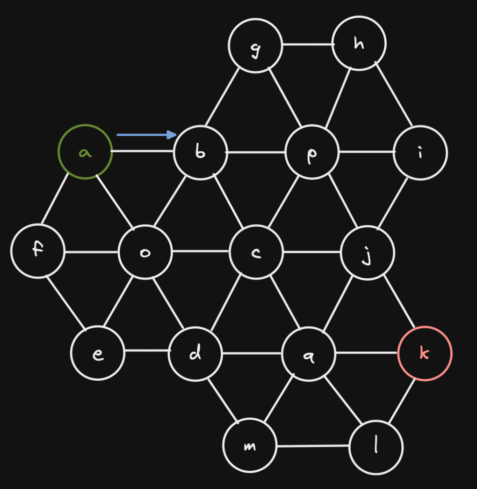
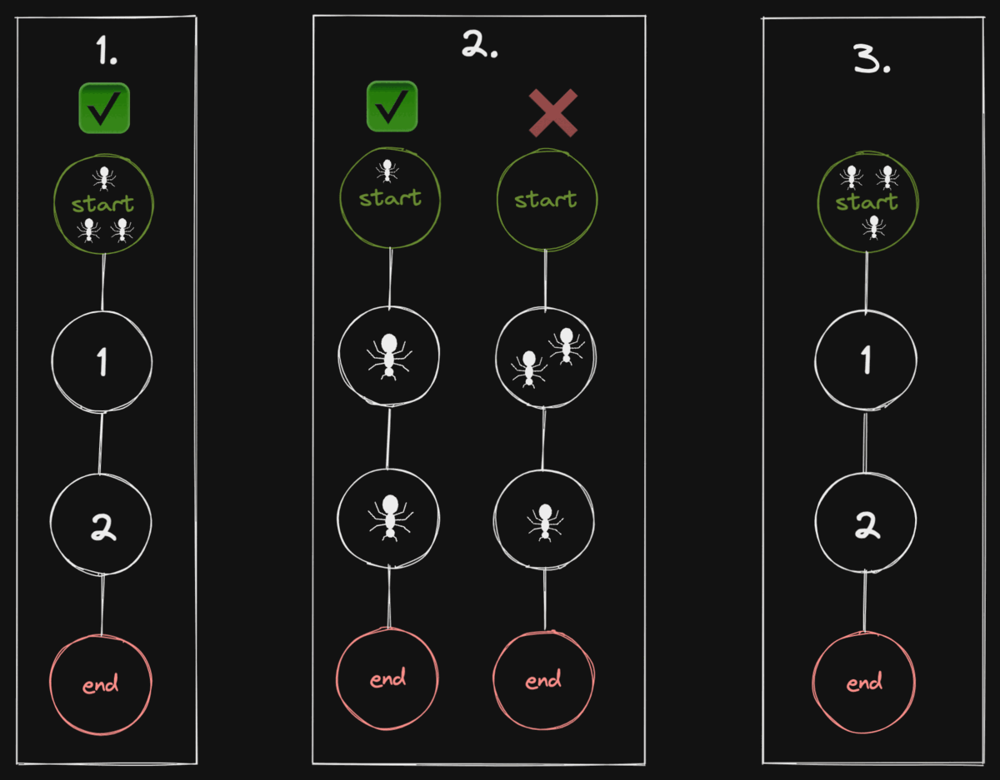
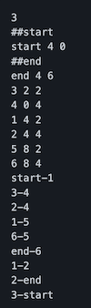
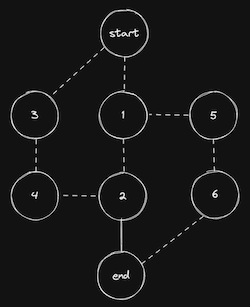
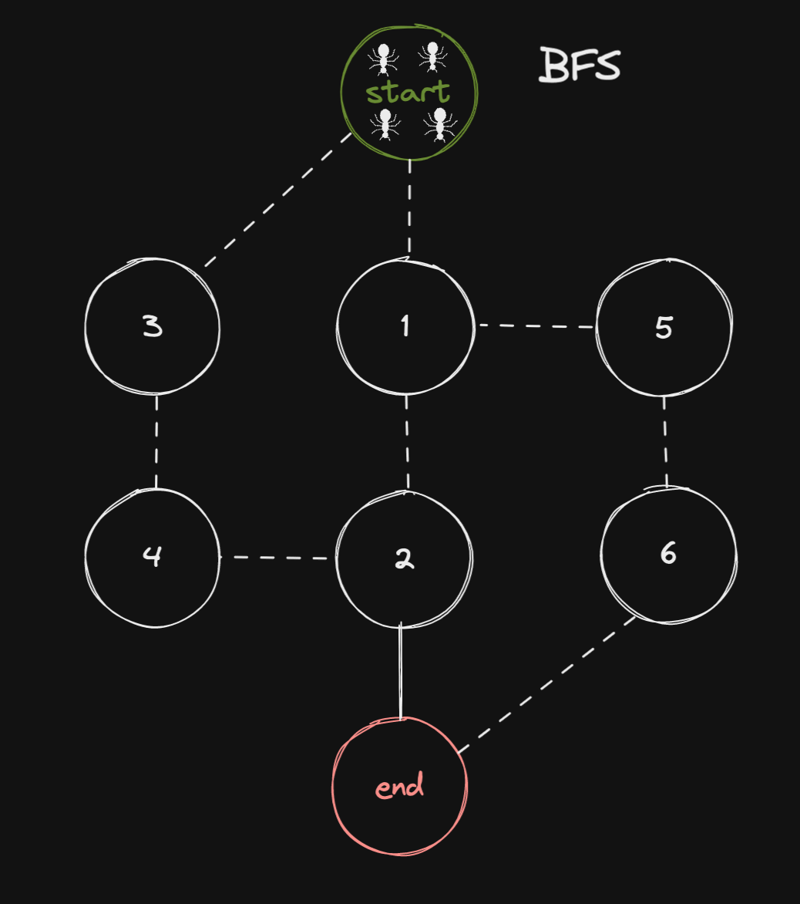

# Lem-in - "Pathfinding Algorithm"



## Table of Contents

[Description](#description)

[Input](#input)

[Output](#output)

[How to use](##howtouse)

[Algorithm](#algorithm)

[Extra](#Extra)

[Resources](#resources)

[Tools](#tools)

[Keywords](#keywords)

<!-- <p align="left"></p> -->
## Description

> Main idea behind project `Lem-in` is to find most efficient set of paths to move ***n*** amount of ants from `##start` room to the `##end` room. There are certain rules what we need to follow:

1. When program starts, all of the ants are in `##start` room.

2. Room can contain only one ant at the time. `##start` and `##end` room can contain unlimited amount of ants.

3. Each turn you can move every single ant ones.



## Input

> Best way to input ant farm of your choice is to create file and specify your map there.<br>
>Here is list of all the specifications what file can and cannot contain:

| Description | Command | Note |
| --- | --- | --- |
| First line of the file | `21` | First line is always the ant count |
| Specify start room | `##start` | **REQUIRED** |
| Specify end room | `##end` | **REQUIRED**  |
| Comment | `#` | All comments will be ignored  |
| Specify room | `start 0 1` | Room name cannot start with `L` or `#`. Also name cannot contain `-` character |
| Describe link between two rooms | `start-end` |  |
| Extra commands | `##anything` |  Extra commands will be ignored |

Ant farm | Map visualization
:-------------------------:|:-------------------------:
  |  

## Output

> Output format of the program is following:<br>
`Lx-y Lz-w Lr-o`<br>
> x, z, and r represents ant number (going from 1 to number_of_ants).<br>
> y, w, and o represents room names.<br>
> One line == One turn

> When we use map shoved above, output is following:<br>
`L1-1 L2-3`<br>
`L1-5 L2-4 L3-1 L4-3`<br>
`L1-6 L2-2 L3-5 L4-4`<br>
`L1-end L2-end L3-6 L4-2`<br>
`L3-end L4-end`<br>



## How to use <a name="howtouse"></a>

### Compiling

> At the root of repository there is a `Makefile`, simply running `make` will compile the whole program - name of the program will be `lem-in`.

### Running `lem-in`

`lem-in < name_of_the_map`

### Running with flags

#### `-l` Flag

> Running `lem-in` with flag `-l` will show how many turns it took to move all ants from `##start` to `##end`.

`lem-in -l < name_of_the_map`

```text
./lem-in -l < eval_tests/test_maps/example_3.map
L1-1 L2-3
L1-5 L2-4 L3-1 L4-3
L1-6 L2-2 L3-5 L4-4
L1-end L2-end L3-6 L4-2
L3-end L4-end
Move count:
5
```

#### `-p` Flag

> Running `lem-in` with flag `-p` will show set of paths used to move ants from `##start` to `##end`.

`lem-in -p < name_of_the_map`

```text
./lem-in -p < eval_tests/test_maps/example_3.map
Our Algo chose paths: 
PATH [1] = start -> 1 -> 5 -> 6 -> end length = 3
PATH [2] = start -> 3 -> 4 -> 2 -> end length = 3
```

## Algorithm

test

## Resources

### Vertex disjoint paths

[Disjoint Paths](https://matthewdaws.github.io/blog/2015-06-08-Paths.html)

[Disjoint Paths; Implementation Issues](https://matthewdaws.github.io/blog/2015-06-15-Paths-Implementation.html)

### Edmonds–Karp

[Edmonds-Karp - YouTube](https://www.youtube.com/watch?v=RppuJYwlcI8&ab_channel=WilliamFiset)

[Edmonds-Karp algorithm - Wikipedia](https://en.wikipedia.org/wiki/Edmonds%E2%80%93Karp_algorithm)

### Maximum flow problem

[Maximum flow problem - Wikipedia](https://en.wikipedia.org/wiki/Maximum_flow_problem)

## Tools

### Drawings

[Excalidraw](https://excalidraw.com/)

[Graph Editor](https://csacademy.com/app/graph_editor/)

### Keywords

- Algorithms
- Path finding
- Edmons-Karp
- Breadth-first search
- Max-flow min-cut theorem
